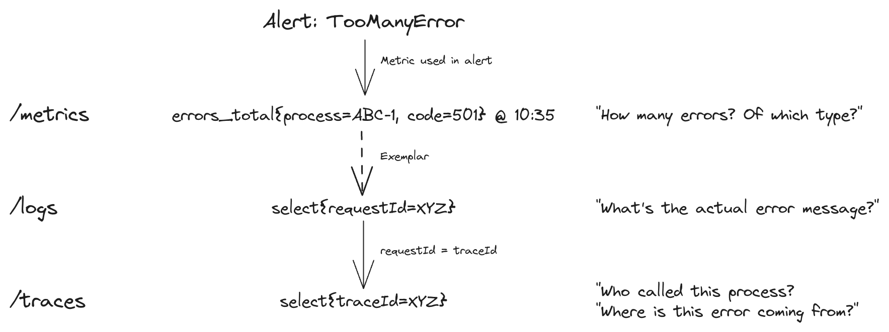

## 2. Conceptos básicos

> _"Capacidad de determinar el estado interno de un sistema a partir de sus
> salidas externas en un tiempo finito" ── Rudolf Emil Kálmán_

Notes:
- Proveniente de la teoría del control
- Propio de la ingeniería y matemática aplicada
- Relacionado con sistemas dinámicos

<!--v-->

### Las tres señales

 

| Señal | Volumen | Característica |
|---|---|---|
| Métricas | Menor | Agrupables, ideales para alertas y escalado |
| Logs | Mayor | Eventos discretos en un instante de tiempo, detalle de operaciones |
| Trazas | Mayor | Eventos distribuidos, visibilidad end-to-end |

 

> _Fuente: CNCF TAG Observability Whitepaper_

<!--v-->

## Métricas

Valores numéricos que representan el estado de un recurso en un instante de tiempo.

Compuestas por: **nombre** · **timestamp** · **valor** · **labels**

 

Conjuntos de métricas estándar:

| Método | Siglas | Aplica a |
|---|---|---|
| **USE** | Utilización · Saturación · Errores | Recursos (CPU, memoria, red) |
| **RED** | Rate · Errors · Duration | Servicios web |
| **Golden Signals** | Latencia · Tráfico · Errores · Saturación | Sistemas distribuidos (Google SRE) |

<!--v-->

## Logs

Describen **eventos discretos** que ocurren en un instante de tiempo.

Características clave:

- Representados por timestamp + mensaje (texto plano o estructurado)
- Deben escribirse a **stdout/stderr** (factor 11 de Twelve-Factor App)
- Formato estructurado (JSON, Logfmt) facilita el procesamiento centralizado

 

Formatos comunes: **CLF** (Nginx/Apache) · **Logfmt** · **Syslog** (RFC 3164 / RFC 5424)

<!--v-->

## Trazas

Describen el **flujo completo de un requerimiento** desde que ingresa al sistema hasta que retorna al usuario.

Unidad mínima: el **Span** — representa una operación con duración medible

gantt
    dateFormat x
    axisFormat %Lms
    section GET /api/posts [52ms]
    GET /api/posts        :0, 52
    wpdb.query SELECT     :5, 15
    wpdb.query SELECT     :15, 20
    wpdb.connect          :20, 29

<!--v-->

### Correlación de señales

Las tres señales pueden relacionarse entre sí mediante metadatos compartidos:

| Mecanismo | Descripción |
|---|---|
| **Ventana temporal** | Filtrar las tres señales por el mismo instante |
| **Request / Trace ID** | Navegar de logs a la traza exacta del requerimiento |
| **Exemplars** | Enlace directo desde una métrica a la traza que la generó |

 

> _La correlación transforma datos aislados en información accionable_

<!--v-->

### Correlación de señales - Ejemplo práctico

_Fuente: CNCF TAG Observability Whitepaper_